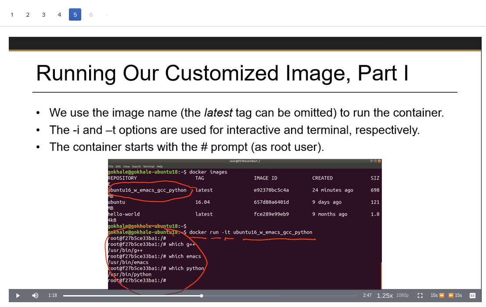
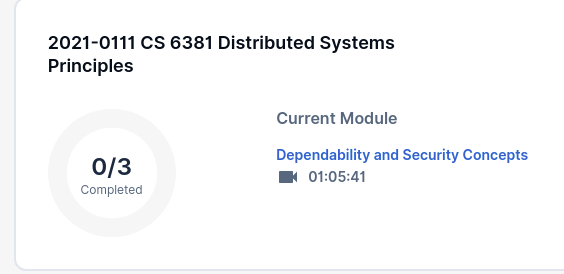
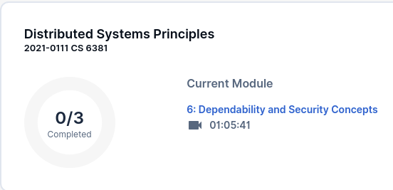

# 2U Better

Adds enhancements to [LMS](https://en.wikipedia.org/wiki/Learning_management_system) [2U](https://2u.com/)

## Usage

Copy the contents of the 2u.js file and paste it into a custom javascript extension such as [cjs](https://chrome.google.com/webstore/detail/custom-javascript-for-web/poakhlngfciodnhlhhgnaaelnpjljija?hl=en). Note: I tried to get this to work as a traditional user script, but the video player enhancements would not work.

## Enhancements:

### Video Player

* Remember current time of video playback accross refresh.
* Remember last used playback rate/speed.
* Auto-play videos.
* Make video player wider when not full-screen.
* Adds skip-forward and skip-backward buttons to quickly jump 15 seconds forward or back.
* Auto-advance to next lecture when playback ends.

### Dashboard

* Show the name of the course much larger than the couse number
* Show the week number ahead of the section name

#### Without 2U Better

#### With 2VU Better

