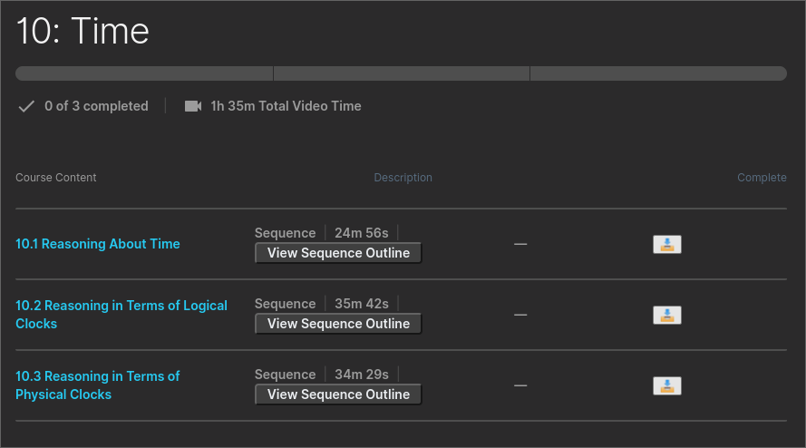

# 2U Better

Adds enhancements to [LMS](https://en.wikipedia.org/wiki/Learning_management_system) [2U](https://2u.com/)

**Disclaimer**: This is not intended to be a way to exploit the 2U platform or any sort of a "hack." I'm a student and I've found the platform in need of some enhancements. I pay a lot of money to go to school. I should be able to download the videos of my courses easily. Accessing my classes shouldn't be any more painful than it already is. That being said, I'm not trying to bash 2U. In fact, I'd love to see them implement these features and let me delete this repo.

## Usage

Copy the contents of the 2u.js file and paste it into a custom javascript extension such as [cjs](https://chrome.google.com/webstore/detail/custom-javascript-for-web/poakhlngfciodnhlhhgnaaelnpjljija?hl=en). Note: I tried to get this to work as a traditional user script, but the video player enhancements would not work.

## Enhancements:

### Video Player

* Remember current time of video playback accross refresh.
* Remember last used playback rate/speed.
* Auto-play videos.
* Make video player wider when not full-screen.
* Adds skip-forward and skip-backward buttons to quickly jump 15 seconds forward or back.
* Auto-advance to next lecture when playback ends.

### Course Page

* Easily download the videos of a course without needing to go into each lecture.

### Dashboard

* Show the name of the course much larger than the couse number
* Show the week number ahead of the section name

#### Without 2U Better

#### With 2VU Better

